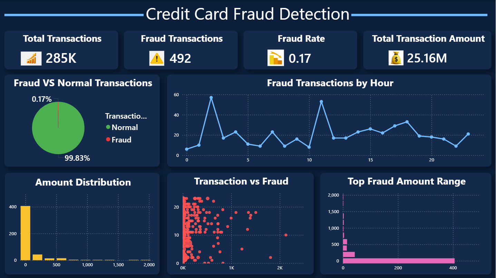

# Credit Card Fraud Detection

## 📌 Project Overview

Credit Card Fraud Detection is a Machine Learning project designed to identify fraudulent credit card transactions.

The project analyzes transaction data and detects patterns that can help distinguish between normal and fraudulent transactions.

## 📊 Dashboard

## 🎯 Objectives

- Detect fraudulent credit card transactions
- Analyze transaction amounts
- Identify fraud patterns by hour
- Compare fraud and normal transactions
- Visualize fraud-related insights using a dashboard

## 🛠️ Technologies Used

- Python
- Pandas
- NumPy
- Scikit-learn
- Matplotlib
- Seaborn
- Machine Learning
- Data Visualization

